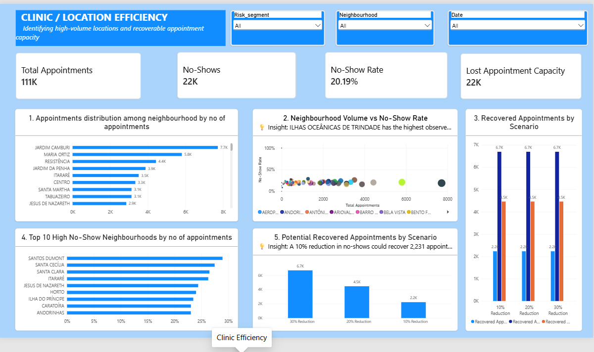
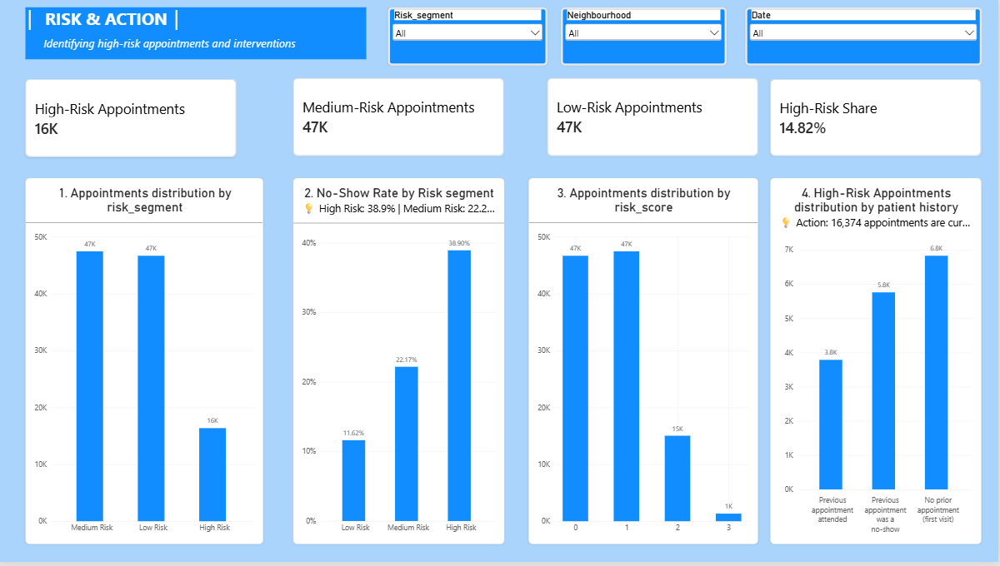

# Patient No-Show & Clinic Efficiency Analysis

End-to-end healthcare analytics project that identifies why patients miss scheduled clinic appointments, quantifies how much appointment capacity is lost as a result, and delivers evidence-based operational recommendations to recover it.

**[Open the live Streamlit dashboard](https://pratik-1678-patient-no-show-clinic-efficien-streamlitapp-osx6gu.streamlit.app/)**

**Tools:** Excel · Python (pandas, matplotlib, seaborn, scipy) · MySQL · Power BI · Streamlit + Plotly

---

## Business Problem

Every missed appointment costs a clinic staff time, an unused slot, and lost revenue. Unlike a cancellation, a no-show arrives with no warning, so the slot usually can't be backfilled. Clinic management needed answers to four questions before they could act:

1. How large is the no-show problem, really?
2. Which factors *actually* predict a no-show — as opposed to merely correlating with it?
3. How much appointment capacity is being lost, and where does it concentrate?
4. What specific, defensible actions would reduce it?

This project answers all four, moving beyond a simple "% no-show" report to a full diagnostic: statistically validated drivers, a risk-prioritization tool clinic staff can actually use, and a quantified capacity-recovery estimate.

---

## Dataset

[Kaggle — Medical Appointment No Shows](https://www.kaggle.com/datasets/joniarroba/noshowappointments): 110,527 real appointment records from a Brazilian public healthcare system (Nov 2015 – Jun 2016). One row = one scheduled appointment.

After cleaning (6 records removed: 1 invalid age, 5 impossible negative lead times), the working dataset is **110,521 appointments across 62,298 patients**.

---

## Key Results

| Metric | Value |
|---|---|
| Total appointments analyzed | 110,521 |
| Total patients | 62,298 |
| No-show rate | 20.19% |
| Show rate | 79.81% |
| Average lead time | 10.2 days |
| Estimated lost appointment capacity | 22,314 slots |

**What drives a no-show, in order of strength:**

1. **Lead time is the strongest predictor** (Cramér's V = 0.295). No-show rate climbs from 4.6% for same-day appointments to 33.0% for those booked 31+ days out. Appointments booked 8+ days in advance make up 36% of volume but account for **57.1% of all lost capacity**.
2. **Prior no-show history is the second-strongest predictor** (Cramér's V = 0.169). A patient with one prior no-show is nearly twice as likely to miss their next appointment (35.2% vs. 18.0%).
3. **A simple 3-rule risk score** — no machine learning required — cleanly separates risk: 11.6% no-show rate for Low Risk patients vs. 38.9% for High Risk.
4. **SMS reminders work — but a naive before/after comparison says the opposite.** Reminders are disproportionately sent to already higher-risk, long-lead-time patients. Once that confound is controlled for, reminders show a real, consistent benefit.
5. **Lost capacity is geographically concentrated** in 11 neighborhoods that are simultaneously high-volume and above-average no-show rate, led by ITARARÉ (26.3%).
6. **Gender and alcoholism were formally ruled out** as drivers (p = 0.17 and p = 0.97 respectively) and excluded from all recommendations — a deliberate check against spurious correlation.

---

## Business Recommendations

1. Add proactive reconfirmation calls for appointments booked 8+ days in advance — the single highest-leverage intervention window.
2. Flag patients with 2+ prior no-shows for personal outreach rather than automated reminders alone.
3. Operationalize the 3-rule risk score so front-desk staff can prioritize daily outreach without needing a data team.
4. Continue and expand SMS reminders specifically for long-lead-time bookings, where they show the clearest controlled benefit.
5. Target location-based outreach at the 11 identified high-volume, high-no-show neighborhoods.

Full detail and supporting analysis: [`docs/business_insights.md`](docs/business_insights.md)

---

## Methodology

**1. Data Cleaning & Feature Engineering** (`notebooks/01_data_cleaning.ipynb`)
Standardized column names, fixed source typos (`Hipertension` → `hypertension`, `Handcap` → `handicap`), removed invalid records, verified zero duplicates/missing values, and engineered `lead_time_days`, `waiting_time_group`, `age_group`, `appointment_weekday`, `prior_no_show`, `chronic_condition_count`, and a rule-based `risk_score` / `risk_segment`.

**2. Exploratory Analysis** (`notebooks/02_exploratory_analysis.ipynb`)
No-show patterns examined across 9 business dimensions: age, gender, lead time, reminders, weekday, location, patient history, and medical conditions.

**3. Statistical Validation** (`notebooks/03_statistical_validation.ipynb`)
Chi-square tests and Cramér's V effect sizes used to separate genuine predictive drivers from noise — the step that distinguishes this from a purely descriptive report.

**4. Business Segmentation** (`notebooks/04_business_segmentation.ipynb`)
A transparent, explainable 3-rule risk score (Low / Medium / High), chosen deliberately over a black-box model so clinic staff can trust and apply it directly.

**5. Clinic Efficiency Analysis** (`notebooks/05_clinic_efficiency.ipynb`)
Utilization rates, lost capacity estimates, recovery scenarios (10% / 20% / 30% no-show reduction), and an impact/priority ranking of recommended actions.

**6. SQL Analysis** (`sql/clinic_analysis.sql`)
23 queries against a live MySQL `clinic_analytics` database, including a CTE + window-function query linking each appointment to whether that same patient's *previous* appointment was a no-show, and an `NTILE`-based query identifying high-volume, high-no-show neighborhoods.

**7. Power BI Dashboard**
Star-schema model (`FactAppointments` + `DimDate` / `DimPatient` / `DimLocation`) with a 3-page executive dashboard:
- **Executive Overview** — top-line KPIs, attendance trend, weekday/age breakdowns
- **No-Show Drivers** — lead time, the controlled reminder comparison, patient history
- **Clinic Efficiency & Action Plan** — lost capacity, recovery scenarios, impact/priority table

Full documentation: [`docs/power_bi_data_model.md`](docs/power_bi_data_model.md), [`docs/power_bi_dax_measures.md`](docs/power_bi_dax_measures.md),

**8. Streamlit Dashboard** (`streamlit/app.py`)
An interactive, filterable alternative to the Power BI dashboard, built with Plotly.

---

## Dashboard Preview






---

## Project Structure

```
patient-no-show-clinic-efficiency/
├── data/
│   ├── raw/                    # Original Kaggle CSV
│   └── cleaned/                 # Cleaned + segmented datasets (regenerated by notebooks 01, 04)
├── notebooks/
│   ├── 01_data_cleaning.ipynb
│   ├── 02_exploratory_analysis.ipynb
│   ├── 03_statistical_validation.ipynb
│   ├── 04_business_segmentation.ipynb
│   └── 05_clinic_efficiency.ipynb
├── sql/
│   ├── 00_create_table.sql
│   └── clinic_analysis.sql
├── powerbi/
│   ├── data_model/              # Fact/dimension CSVs for import
│   └── clinic_dashboard.pbix
├── streamlit/
│   ├── app.py
│   └── requirements.txt
├── excel/
│   └── phase2_audit_workbook.xlsx
├── outputs/
│   ├── charts/                  # Notebook-generated PNGs
│   └── screenshots/             # Power BI dashboard screenshots
├── docs/
│   ├── data_dictionary.md
│   ├── business_insights.md
│   ├── executive_summary.md
│   ├── power_bi_data_model.md
│   ├── power_bi_dax_measures.md
├── requirements.txt
└── .gitignore
```

---

## How to Run

The interactive dashboard is also available online: **[Launch Streamlit](https://pratik-1678-patient-no-show-clinic-efficien-streamlitapp-osx6gu.streamlit.app/)**.

```bash
# 1. Install dependencies
pip install -r requirements.txt

# 2. Run notebooks in order
jupyter notebook notebooks/01_data_cleaning.ipynb
# ... continue through 02 → 05

# 3. MySQL analysis
mysql -u root < sql/00_create_table.sql
# Load the cleaned CSV into the `clinic_analytics` database, then:
mysql -u root clinic_analytics < sql/clinic_analysis.sql

# 4. Power BI
# Open powerbi/clinic_dashboard.pbix in Power BI Desktop

# 5. Streamlit dashboard
cd streamlit
streamlit run app.py
```

---

## Skills Demonstrated

Data cleaning & validation · feature engineering · exploratory data analysis · hypothesis testing (chi-square, effect sizes) · rule-based segmentation as an alternative to machine learning · SQL (CTEs, window functions, `HAVING`, `NTILE`) · dimensional / star-schema data modeling · DAX · interactive dashboard development (Power BI + Streamlit) · translating statistical findings into operational business recommendations

---

## About

Portfolio project analyzing 110K+ real clinic appointment records to diagnose no-show drivers and quantify recoverable capacity for clinic operations. Built to demonstrate the full analytics lifecycle: from raw data through statistical validation to a decision-ready dashboard.
